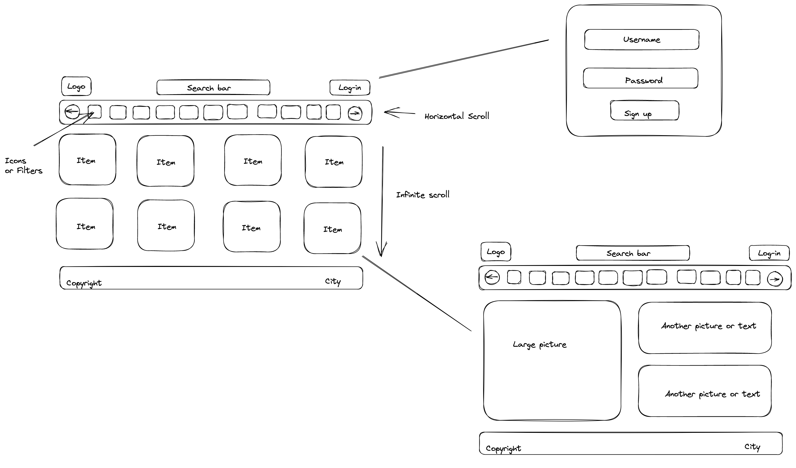
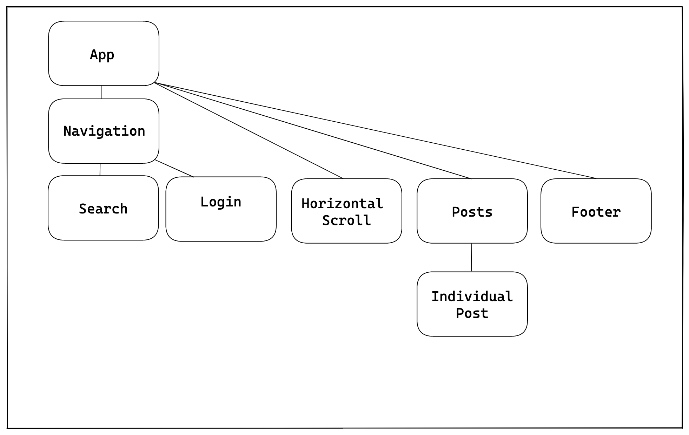

# PROJECT 3: dumpster.io

## Description:
​
Our MERN stack project will be a pseudo ecommerce site called **dumpster.io**.

We will model the UI as close as possible to AirBNB and our group will be using Craigslist free listings as our data source. 

Instead of buying houses, the site/app will be able to show you local free listings from Craigslist (for us it will be NYC).

The site / app will have authentication, database (Craigslist JSON/scraper depending), react, and node. 

Our main goal is to meet these requirements and have a decent ui / clean ui just like AirBNB. 

For MVP would be a functional backend with functional authentication, and professional looking front end.

Team Expectations: [https://bit.ly/3Jh7U3I](https://bit.ly/3Jh7U3I)

***

## MVP: ##
​
Frontend to have an extremely clean front end. Have functioning authentication for users.
​
## Post-MVP: ##
​
To have functioning search bar. Also to have a frontend that is just as sleek, if not match AirBNB as close as
​
## Goals: ##
​
To complete the front end, back end, and css done by Monday. Ideally be able to handle any git issues monday. Realistically, may be to have most of the site functioning by Tuesday then git issues after. 

***

## Design Reference:



***

## Routes: ##

| Route                 | HTTP Method | DB Action  | Description                         |
|-----------------------|-------------|------------|-------------------------------------|
| /api/signup           | POST        | POST       | User creates an account             |
| /api/login            | GET         | GET        | User logs in to said account        |
| /           | GET        | GET       | List all posts             |
| /api/upload            | POST         | POST        | User can upload new item if logged in        |
| /api/edit            | PUT         | PUT        | User can edit one of their uploaded posts |
| /api/delete            | DELETE         | DELETE        | User can delete an item       |
​
## Schema: ##
```
  export const userSchema = new mongoose.Schema({
    username: String,
    hash: String,
    posts: []
  })

  export const productSchema = new mongoose.Schema({
    title: String, 
    author: { type: mongoose.Schema.Types.ObjectId, ref: 'User' },
    description: String,
    tags: [],
    time: Date, 
    location: {
      lat: Number,
      long: Number
    }
  })
```

## Component Tree:



***


